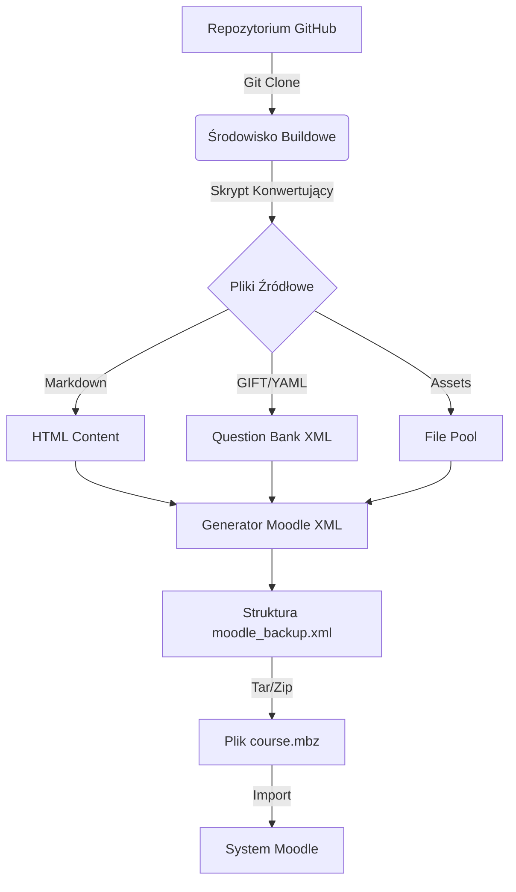

# Praktyczny Przewodnik Wdrożeniowy: Od Repozytorium GitHub do Kursu Moodle

## 1. Cel i Zakres Dokumentu

Niniejszy dokument stanowi finalny element triady przewodników poświęconych integracji agentów AI (Qwen Code i Qwen Coder) z systemem Moodle. Podczas gdy pierwsze dwa dokumenty omawiały architekturę repozytorium oraz specyfikację formatów plików, ten przewodnik koncentruje się na **procesie wdrożeniowym**.

Opisuje on krok po kroku ścieżkę transformacji plików źródłowych znajdujących się w repozytorium GitHub w gotowy do zaimportowania pakiet `.mbz` (Moodle Backup), który można wgrać na dowolną platformę edukacyjną. Dokument zawiera przykłady skryptów, konfigurację potoków CI/CD oraz procedury walidacji jakości generowanych kursów.

---

## 2. Przegląd Procesu Konwersji

Proces przekształcania kodu w kurs składa się z czterech głównych etapów:

1. **Ekstrakcja:** Pobranie najnowszej wersji plików z repozytorium GitHub.
2. **Parsowanie i Transformacja:** Odczyt plików Markdown, GIFT, YAML i XML, a następnie przekonwertowanie ich na obiekty wewnętrzne Moodle.
3. **Generowanie Struktury Backupu:** Utworzenie tymczasowego katalogu o strukturze wymaganej przez API backupu Moodle (zawierającego plik `moodle_backup.xml` i podkatalogi z danymi).
4. **Pakowanie:** Skompresowanie struktury do formatu ZIP i zmiana rozszerzenia na `.mbz`.



---

## 3. Narzędzia i Środowisko

Do poprawnego przeprowadzenia konwersji niezbędne jest odpowiednie środowisko. Zalecane podejście opiera się na konteneryzacji (Docker) lub wirtualnym środowisku Python.

### 3.1. Wymagane Biblioteki Python

Projekt powinien wykorzystywać następujące biblioteki (plik `requirements.txt`):

```text
pyyaml>=6.0
markdown>=3.4
gift-parser>=1.0
lxml>=4.9
requests>=2.28
```

### 3.2. Narzędzia Systemowe
- `git`: Do zarządzania wersjami.
- `zip` / `tar`: Do pakowania wyników.
- `python3`: Środowisko uruchomieniowe.

---

## 4. Implementacja Skryptu Konwertującego (Converter Script)

Poniżej przedstawiono szkielet profesjonalnego skryptu w języku Python, który odpowiada za logikę konwersji. Jest to punkt wyjścia dla dalszego rozwoju przez Qwen Coder.

### 4.1. Struktura Skryptu `convert_to_moodle.py`

```python
import os
import json
import yaml
import markdown
import shutil
import zipfile
from pathlib import Path
from datetime import datetime
import xml.etree.ElementTree as ET

class MoodleCourseBuilder:
    def __init__(self, source_dir, output_dir):
        self.source_dir = Path(source_dir)
        self.output_dir = Path(output_dir)
        self.backup_dir = self.output_dir / "temp_backup"
        self.files_dir = self.backup_dir / "files"
        self.questions_dir = self.backup_dir / "questions"
        
    def build(self):
        """Główna metoda uruchamiająca proces budowania."""
        print(f"Rozpoczynanie budowania kursu z: {self.source_dir}")
        self._prepare_directories()
        self._process_course_metadata()
        self._process_sections()
        self._process_question_banks()
        self._generate_manifest()
        self._package_mbz()
        self._cleanup()
        print(f"Zakończono. Pakiet dostępny w: {self.output_dir}")

    def _prepare_directories(self):
        if self.backup_dir.exists():
            shutil.rmtree(self.backup_dir)
        self.files_dir.mkdir(parents=True, exist_ok=True)
        self.questions_dir.mkdir(parents=True, exist_ok=True)

    def _process_course_metadata(self):
        """Wczytuje course.json i przygotowuje zmienne globalne kursu."""
        meta_file = self.source_dir / "course.json"
        if not meta_file.exists():
            raise FileNotFoundError("Brak pliku course.json")
        
        with open(meta_file, 'r', encoding='utf-8') as f:
            self.course_meta = json.load(f)
        
        # Tutaj należy dodać logikę mapowania JSON na obiekt Course Moodle

    def _process_sections(self):
        """Iteruje po katalogach sekcji i konwertuje aktywności."""
        sections_path = self.source_dir / "sections"
        if not sections_path.exists():
            return

        for section_dir in sorted(sections_path.iterdir()):
            if not section_dir.is_dir():
                continue
            
            section_number = int(section_dir.name.split('_')[0])
            print(f"Przetwarzanie sekcji {section_number}: {section_dir.name}")
            
            for file in section_dir.iterdir():
                if file.suffix == '.md':
                    self._convert_markdown_to_activity(file, section_number)
                elif file.suffix == '.yaml':
                    self._convert_yaml_to_activity(file, section_number)

    def _convert_markdown_to_activity(self, file_path, section_num):
        """Konwertuje plik MD na zasób Moodle (Page/Label)."""
        with open(file_path, 'r', encoding='utf-8') as f:
            content = f.read()
        
        # Rozdzielenie Front-Matter od treści
        # (Implementacja parsera YAML front-matter pominięta dla zwięzłości)
        # metadata = ...
        # body = ...
        
        html_content = markdown.markdown(content)
        
        # Zapisanie jako plik HTML w strukturze backupu
        # Aktualizacja pliku manifestu activities
        pass

    def _process_question_banks(self):
        """Konwertuje pliki GIFT i XML na format Question Bank Moodle."""
        qb_path = self.source_dir / "question_banks" / "questions"
        if not qb_path.exists():
            return

        all_questions_xml = ET.Element("quiz")
        
        for file in qb_path.iterdir():
            if file.suffix in ['.gift', '.txt']:
                questions = self._parse_gift_file(file)
                # Dodanie pytań do drzewa XML
            elif file.suffix == '.xml':
                # Połączenie istniejących XML-i
                pass
        
        # Zapisanie połączonego pliku questions.xml
        tree = ET.ElementTree(all_questions_xml)
        tree.write(self.questions_dir / "questions.xml", encoding='utf-8')

    def _parse_gift_file(self, file_path):
        """Prosty parser GIFT (w produkcji użyć biblioteki gift-parser)."""
        questions = []
        with open(file_path, 'r', encoding='utf-8') as f:
            lines = f.readlines()
        # Logika parsowania linii...
        return questions

    def _generate_manifest(self):
        """Tworzy główny plik moodle_backup.xml."""
        # Ten plik jest krytyczny. Musi zawierać informacje o:
        # - info (nazwa kursu, autor, data)
        # - settings (format, liczba sekcji)
        # - activities (lista wszystkich aktywności)
        # - files (mapowanie plików)
        # - questions (referencje do banku pytań)
        
        root = ET.Element("moodle_backup")
        # ... wypełnianie struktury XML zgodnej ze specyfikacją Moodle
        
        tree = ET.ElementTree(root)
        tree.write(self.backup_dir / "moodle_backup.xml", encoding='utf-8')

    def _package_mbz(self):
        """Pakuje katalog temp_backup do formatu .mbz."""
        mbz_path = self.output_dir / f"{self.course_meta['shortname']}.mbz"
        
        with zipfile.ZipFile(mbz_path, 'w', zipfile.ZIP_DEFLATED) as zipf:
            for foldername, subfolders, filenames in os.walk(self.backup_dir):
                for filename in filenames:
                    file_path = Path(foldername) / filename
                    arcname = file_path.relative_to(self.backup_dir)
                    zipf.write(file_path, arcname)
        
        print(f"Utworzono pakiet: {mbz_path}")

    def _cleanup(self):
        """Usuwa pliki tymczasowe."""
        if self.backup_dir.exists():
            shutil.rmtree(self.backup_dir)

if __name__ == "__main__":
    import argparse
    parser = argparse.ArgumentParser(description='Build Moodle Course from Git Repo')
    parser.add_argument('--input', required=True, help='Path to course source directory')
    parser.add_argument('--output', required=True, help='Path to output directory')
    args = parser.parse_args()

    builder = MoodleCourseBuilder(args.input, args.output)
    builder.build()
```

---

## 5. Automatyzacja z GitHub Actions

Aby proces był w pełni automatyczny, należy skonfigurować workflow w GitHub Actions. Plik `.github/workflows/moodle-build.yml` powinien wyzwalac się przy każdym pushu do gałęzi `main` lub ręcznie.

### 5.1. Przykład Zaawansowanego Workflow

```yaml
name: Moodle Course Builder

on:
  push:
    branches: [ "main" ]
    paths:
      - 'courses/**'
      - 'scripts/**'
  workflow_dispatch:
    inputs:
      course_id:
        description: 'Kod kursu do zbudowania (np. MAT-101)'
        required: true
        default: 'MAT-101'

jobs:
  build-course:
    runs-on: ubuntu-latest
    
    steps:
    - name: Checkout Repository
      uses: actions/checkout@v3

    - name: Set up Python
      uses: actions/setup-python@v4
      with:
        python-version: '3.10'

    - name: Install Dependencies
      run: |
        python -m pip install --upgrade pip
        pip install -r requirements.txt

    - name: Determine Course ID
      id: course_detect
      run: |
        if [ "${{ github.event_name }}" == "workflow_dispatch" ]; then
          echo "COURSE_ID=${{ github.event.inputs.course_id }}" >> $GITHUB_OUTPUT
        else
          # Automatyczna detekcja zmienionych kursów (uproszczone)
          echo "COURSE_ID=ALL" >> $GITHUB_OUTPUT
        fi

    - name: Build Course Package
      run: |
        COURSE_DIR="courses/${{ steps.course_detect.outputs.COURSE_ID }}"
        if [ -d "$COURSE_DIR" ]; then
          python scripts/convert_to_moodle.py --input $COURSE_DIR --output $COURSE_DIR/backups
        else
          echo "Katalog kursu nie znaleziony: $COURSE_DIR"
          exit 1
        fi

    - name: Upload Artifact
      uses: actions/upload-artifact@v3
      with:
        name: moodle-course-package
        path: courses/*/backups/*.mbz
        retention-days: 30

    - name: Create Release (Opcjonalnie)
      if: github.ref == 'refs/heads/main'
      uses: softprops/action-gh-release@v1
      with:
        files: courses/*/backups/*.mbz
        tag_name: course-build-${{ github.run_number }}
        name: Build kursu nr ${{ github.run_number }}
        draft: false
        prerelease: true
```

---

## 6. Procedura Importu do Moodle

Po wygenerowaniu pliku `.mbz`, użytkownik końcowy (nauczyciel/administrator) wykonuje następujące kroki w interfejsie Moodle:

1. **Pobranie artefaktu:** Wejście w zakładkę "Actions" -> "Artifacts" w GitHub Actions i pobranie pliku ZIP zawierającego `.mbz`, lub pobranie bezpośrednio z Releases.
2. **Nawigacja:** W Moodle przejść do: *Administracja kursem* -> *Więcej...* -> *Import*.
3. **Wybór typu:** Wybrać opcję "Plik backupu" (Backup file).
4. **Przesłanie:** Przeciągnąć plik `.mbz` do strefy przesyłania plików (File picker).
5. **Mapowanie:** Przejść przez kreatora importu:
   - *Potwierdzenie:* Sprawdzenie nazwy kursu.
   - *Ustawienia:* Zaznaczenie elementów do zaimportowania (aktywności, bloki, pytania).
   - *Mapowanie ról:* Jeśli nazwy ról różnią się od domyślnych.
6. **Finalizacja:** Kliknąć "Wykonaj import". Kurs pojawi się w kategorii docelowej.

### 6.1. Import przez CLI (Dla Administratorów)

Dla środowisk produkcyjnych zaleca się użycie narzędzia wiersza poleceń Moodle `cli/restore_backup.php`:

```bash
sudo -u www-data php admin/cli/restore_backup.php \
  --file=/path/to/course.mbz \
  --categoryid=5 \
  --fullname="Nowa Nazwa Kursu" \
  --shortname="NOWY_KOD" \
  --userid=2
```

---

## 7. Strategia Testowania i Walidacji

Przed wdrożeniem kursu na środowisko produkcyjne, należy przeprowadzić testy jakościowe.

### 7.1. Testy Jednostkowe Skryptów
Należy utworzyć zestaw testów (np. w `pytest`), które sprawdzają:
- Czy parser GIFT poprawnie interpretuje znaki specjalne?
- Czy linki do assetów w Markdown są poprawnie rozwiązywane?
- Czy plik `moodle_backup.xml` spełnia schemat XSD Moodle?

### 7.2. Środowisko Staging
Zaleca się posiadanie instancji "Moodle Sandbox", na której automatycznie deployowany jest każdy build z GitHub Actions. Pozwala to na wizualną weryfikację kursu przed jego udostępnieniem studentom.

### 7.3. Checklista Walidacyjna
- [ ] Wszystkie obrazy wyświetlają się poprawnie.
- [ ] Quizy mają przypisane punkty i poprawne odpowiedzi.
- [ ] Linki wewnętrzne między sekcjami działają.
- [ ] Ograniczenia czasowe (dates) są ustawione logicznie.
- [ ] Kurs jest responsywny na urządzeniach mobilnych.

---

## 8. Podsumowanie i Najlepsze Praktyki

Wdrożenie architektury "Moodle-as-Code" z wykorzystaniem agentów Qwen Code i Qwen Coder wymaga dyscypliny w utrzymaniu struktury plików. Kluczowe sukcesy zależą od:

1. **Spójności:** Rygorystyczne trzymanie się zdefiniowanej struktury katalogów.
2. **Modularności:** Oddzielenie treści (Markdown) od logiki (YAML/GIFT) i zasobów (Assets).
3. **Automatyzacji:** Maksymalne wykorzystanie CI/CD do eliminacji błędów ludzkich przy pakowaniu.
4. **Dokumentacji:** Bieżące aktualizowanie plików README w repozytorium wraz ze zmianami w strukturze kursu.

Tak przygotowane środowisko pozwala na skalowanie produkcji kursów edukacyjnych, szybkie wprowadzanie poprawek oraz łatwe przenoszenie treści między różnymi instancjami systemu Moodle.
